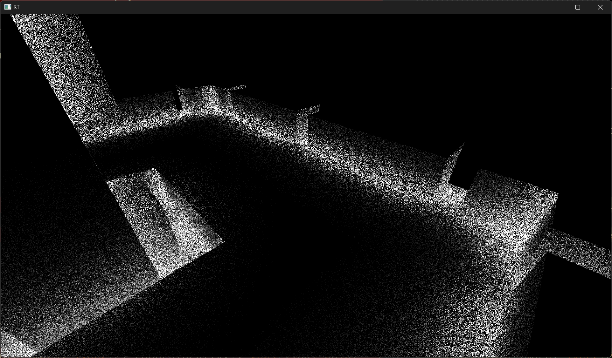

# Ray tracing with ash-rs

## Context

The goal of this project is to create a real-time 3D voxel renderer that only uses hardware ray tracing. The idea was that voxels require less per-object data than regular triangles/meshes (normals can be omitted for example), so every ray tracing feature could be explored and should scale better. In addition to that, the possibility of using axis-aligned data and common data structures (such as sparse voxel octrees) could allow for substantial optimizations. However, as stated in [this article on NVIDIA's blog](https://developer.nvidia.com/blog/best-practices-for-using-nvidia-rtx-ray-tracing-updated/), it seems that tracing against AABBs is, in fact, more expensive than using triangles. This means that the idea of better scaling is refuted, at least as far as the frame rendering is concerned. While this is true for the NVIDIA-specific rendering implementation, this does not mean that a full-voxel engine could not benefit from the scalability induced by the axis-aligned nature of voxels and their simple data. Since this application is not meant to be a full product, ideas are explored and features are added as a way to learn about 3D rendering, the Vulkan API, and Rust.

This application uses [ash](https://github.com/ash-rs/ash), which exposes Rust bindings for the Vulkan API. Its main benefits are memory safety and compatibility with Vulkan extensions, something that [vulkano](https://github.com/vulkano-rs/vulkano) does not fully support. Moreover, as this is a learning project, using lower level Rust and API features with ash felt more appropriate. Right now, VK_KHR_ray_tracing_pipeline extension is used to render the whole image by using a full ray tracing pass.

## Features

The current state of the application features a basic [MagicaVoxel](https://ephtracy.github.io/) model render imported using [dot_vox](https://github.com/dust-engine/dot_vox). The import reads the color palette from the model and sends it to a buffer that the closest-hit shader will read from to choose a render color.

There is also an alternative and experimental ray traced ambiant occlusion method, which is currently not working correctly and noisy, but shows direct benefit of using a ray tracing pipeline.

